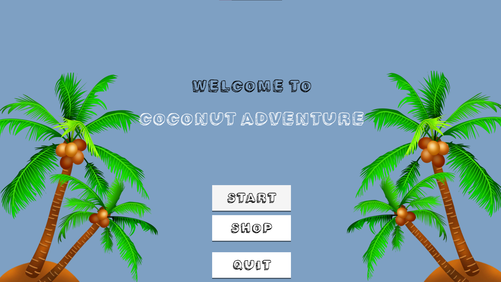
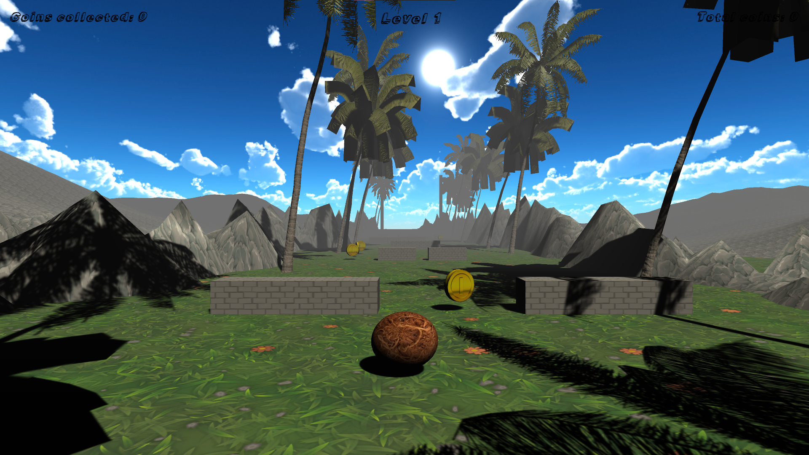

# Coconut Adventure

Coconut Adventure е игра направена во Unity во која има кокос кој се движи, собира парички и избегнува препреки.

Изработена од:

Теодора Дојчиноска 196003

Анастасија Јосифовска 193077

Филип Филипоски 196005

## Целта на играта

Целта на играта е да се движите со кокосот, да не се судрите со препрека и да ги собирате паричките. Ако се судрите со препрека се враќате на почетокот од левелот и треба пак од почеток да го поминете. Има 10 различни левели кои треба да ги поминете за да ја завршите, односно да ја победите играта.

## Објаснување на елементите

На почетокот има Menu во кое може да се избере да почнете да ја играте играта, да влезете во маркет или пак да ја исклучите играта на копчето Quit. Секој левел има player кој го движите вие. Има obsticles елементи, terrain, ground(пат низ кој се движите) и има различни елементи околу патот по кој се движите.

## Опис на класите

Класа за движење на Player во која има функција AddForce која му дава сила на Player да се движи напред и исто така има функција која дозволува да го движите Player со A, D на тастатура.

Класа за кога Player ќе се удри во некој објект или ќе излета надвор од патот по кој треба да се движи PlayerCollision со помош на која се почнува од почеток кога ќе се судрите.

Класа PlayerCollectCoins во која кога ќе се судрите со париче се покажува на екранот дека собирате едно париче.

Класа CollectCoin во која кога ќе се судрите со париче тоа се брише од патот и се додаваат поени на Player.

Класа RotateCoin во која со функција се врти паричето.

Класа Menu која служи да се отвори менито на играта, односно почетната страна на играта.

Класа за секој левел на играта која покажува кој левел сте во моментот.

Класа GameManager во која проверуваме дали сте го завршиле левелот и анимација која покажува дека сте го завршиле, исто така служи и кога ќе се судрите со obsticle да почнете од почеток да го играте истиот левел.

Исто така има класа за отворање и затворање на маркет на почетокот од играта.

Класа FollowPlayer во која камерата го следи Player како thirdPerson point of view игра.

И на крај има класа EndTrigger која гледа дали сме стигнале до крај на левелот или не и не испраќа на нов левел ако сме го поминале левелот.

## Како пример метод со кој се движиме со кокосот по патеката.

    void FixedUpdate()
    {
        rb.AddForce(0, 0, forwardForce * Time.deltaTime);

        if (Input.GetKey("d"))
        {
            rb.AddForce(sidewaysForce * Time.deltaTime, 0, 0, ForceMode.VelocityChange);
        }

        if (Input.GetKey("a"))
        {
            rb.AddForce(-sidewaysForce * Time.deltaTime, 0, 0, ForceMode.VelocityChange);
        }

        if (rb.position.x > 15.5)
        {
            FindObjectOfType<GameManager>().EndGame();
        }
        if (rb.position.x < -15.5)
        {
            FindObjectOfType<GameManager>().EndGame();
        }
    }
    

    
## Објекти

Користиме објекти од Unity Asset Store како на пример, палма, текстура на патот по кој се движи Player, исто така текстура на планина и камења од страната, текстура на париче и на кокосот. Имаме и материјал за небо и материјал за секој објект кој го користиме.
